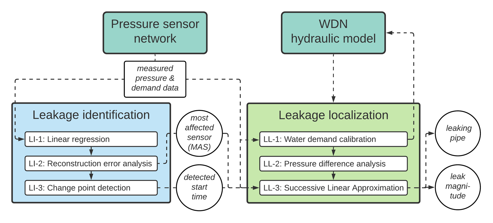

# LILA - the sequential pressure-based algorithm for data-driven Leakage Identification and model-based Localization

This repository contains the Leakage Identification part of **LILA - the sequential pressure-based algorithm for data-driven Leakage Identification
and model-based Localization in water distribution networks**. LILA identifies potential leakages via semisupervised linear regression of pairwise sensor pressure data and provides the location of theis nearest sensor. LILA also locates leaky pipes relying on an initial set of candidate pipes and a simulation-based optimization framework with iterative linear and mixed-integer linear programming.

### Citation

If you use LILA or part of its code, please consider citing [our paper](https://ascelibrary.org/doi/epdf/10.1061/%28ASCE%29WR.1943-5452.0001535) that describes it:

```
Daniel, I., Pesantez, J., Letzgus, S., Khaksar Fasaee, M.A., Alghamdi, F., Berglund, E., Mahinthakumar, G.
and Cominola, A., 2022. A Sequential Pressure-Based Algorithm for Data-Driven Leakage Identification and
Model-Based Localization in Water Distribution Networks. Journal of Water Resources Planning and Management,
148(6), p.04022025. DOI:10.1061/(ASCE)WR.1943-5452.0001535
```

### Authors

- [Ivo Daniel](https://www.swn.tu-berlin.de/menue/team/msc_ivo_daniel/), [Andrea Cominola](https://www.swn.tu-berlin.de/menue/team/prof_dr_andrea_cominola/) - [Chair of Smart Water Networks](https://swn.tu-berlin.de) | [Technische Universität Berlin](https://tu.berlin) and [Einstein Center Digital Future, Berlin](https://digital-future.berlin) (Germany)
- Simon Letzgus - [Machine Learning group](https://www.ml.tu-berlin.de/menue/machine_learning/) | [Technische Universität Berlin](https://tu.berlin) (Germany)

The above authors contributed to the content of this repository. For the full team of authors of LILA, refer to the authors of the above-cited paper.

### Awards

An early version of LILA was awarded the **Third Place Award** for outstanding achievement in the [BattLeDIM 2020](https://battledim.ucy.ac.cy), the Battle of the Leakage Detection and Isolation Methods. Check out this presentation by our Leakbusers team here: https://www.youtube.com/watch?v=PrHgNnQn-lQ

## Getting started with LILA

LILA operates in a sequential way, represented in this flowchart:

_source: underlying work (Daniel et al., 2022)_

### Leakage Identification module

The [`2019_leakage_identification.ipynb`](LI/2019_leakage_identification.ipynb) notebook in folder [LI](LI/) performs the **leakage identification** task, which is designed to raise an alarm about the presence of a potential leak. Firstly, the water distribution network and the time series of pressure at network nodes provided as input are analyzed as a whole to visualize all occurring leakages simultaneously. Thereafter, each identified leak is investigated individually to estimate a precise leak start time.
In general, the leakage identification module performs two sequential steps:

1. **Linear regression analysis** is performed on pairs of time series from pressure data and the residual error of the model is calculated.
2. **Change point detection** is applied to the residual from the pairwise linear regression analysis to provide the starting times of the leaks.

The final section of the [notebook](LI/2019_leakage_identification.ipynb) also provides the code used to generate the following figures in [Daniel et al. (2022)](<DOI:10.1061/(ASCE)WR.1943-5452.0001535>):

- Fig. 3: sensitivity analysis
- Fig. 4: comparison of residual error vs. ground truth
- Fig. 5: exemplary residual error trajectories during leakages with annotations
- Fig. 6: result summary for leakage time-to-detection and total lost water volume
- Fig. 7: result summary for leakage detection distance
- Fig. 9: study of leak-to-noise ratio and cusum hyperparameters
- Fig. 10: time series of residual error for individual leaks used for change point detection

### Leakage Localization module

Part of the code to run the Leakage localization module of LILA is availablle in this repository:
https://github.com/jorgeps86/LeakLocalization

### Dependencies

Dependencies and package version are listed in [`dependencies.md`](https://github.com/SWN-group-at-TU-Berlin/LILA/blob/main/dependencies.md)

## Dataset

The work in this repository is applied to the dataset of the [BattLeDIM 2020](https://battledim.ucy.ac.cy/), the Battle of the Leakage Detection and Isolation Methods. The BattLeDIM dataset is open and available at the links below.
Information on the BattLeDIM can be found at the following links:

- Official website of the BattLeDIM, hosted by the BattLeDIM committee: https://battledim.ucy.ac.cy/
- BattLeDIM problem description and rules: https://zenodo.org/record/3902046
- BattLeDIM dataset: https://zenodo.org/record/4017659#.X4mBaC2w1hE
- BattLeDIM results: https://zenodo.org/record/4139603#.X8lAfbG5p04.mendeley

## References

LILA is fully presented and tested in [Daniel et al. (2022)](<DOI:10.1061/(ASCE)WR.1943-5452.0001535>):

```
Daniel, I., Pesantez, J., Letzgus, S., Khaksar Fasaee, M.A., Alghamdi, F., Berglund, E., Mahinthakumar, G.
and Cominola, A., 2022. A Sequential Pressure-Based Algorithm for Data-Driven Leakage Identification and
Model-Based Localization in Water Distribution Networks. Journal of Water Resources Planning and Management,
148(6), p.04022025. DOI:10.1061/(ASCE)WR.1943-5452.0001535
```

LILA derives from an initial version of the algorithm presented in [Daniel et al. (2020)](https://doi.org/10.5281/zenodo.3924632) and used during the BattLeDIM competition: [](https://doi.org/10.5281/zenodo.3924632)

```
Daniel, Ivo, Pesantez, Jorge, Letzgus, Simon, Khaksar Fasaee, Mohammad Ali, Alghamdi, Faisal, Mahinthajkumar, Kumar,
Berglund, Emily, & Cominola, Andrea. (2020). A high-resolution pressure-driven method for leakage identification and
localization in water distribution networks. Zenodo. https://doi.org/10.5281/zenodo.3924632
```

### LICENSE

Copyright (C) 2021 Ivo Daniel, Simon Letzgus, Andrea Cominola. Released under the [GNU General Public License v3.0](LICENSE). The code is distributed in the hope that it will be useful, but WITHOUT ANY WARRANTY; without even the implied warranty of MERCHANTABILITY or FITNESS FOR A PARTICULAR PURPOSE. See the GNU General Public License for more details. You should have received a copy of the GNU General Public License along with STREaM. If not, see http://www.gnu.org/licenses/licenses.en.html.

## How to run?

```bash
pip install -r requirements.txt

```
